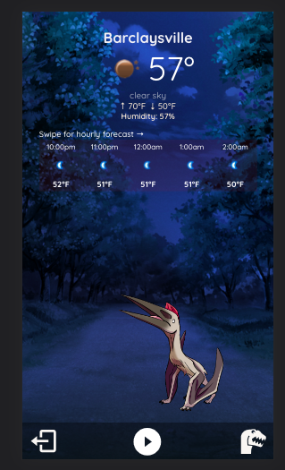
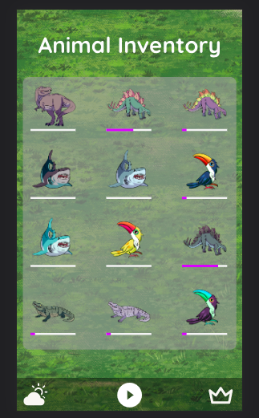
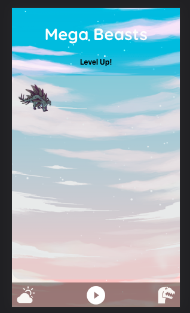

# 'Is It Raining?' - Weather App 🌧️

Final project for Team 17 at Momentum Learning. My team and I wanted to work on something fun and that would help younger users get into the weather more. 

`I worked on the backend and also drew all of the animals for this project.`

- Pulls from OpenWeatherMapAPI to give current and hourly weather
- Displays creatures according to the weather
- User can collect animals + recollect same animal for points
- Points used to power up animal to 'Mega Beast'
- User must wait 12 hours before collecting the same variation of animal again
- Trading animals logic is in place on backend but wasn't implemented in frontend due to time constraints

